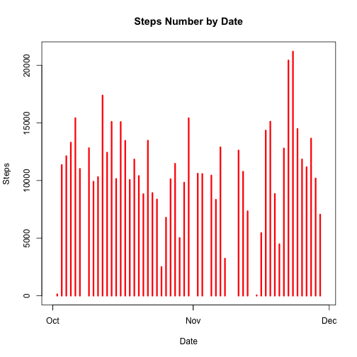
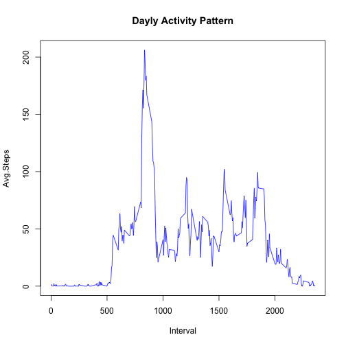
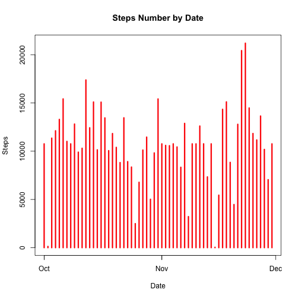
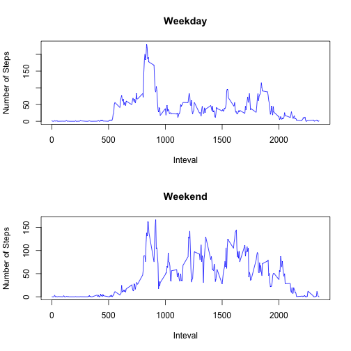

# Reproducible Research: Peer Assessment 1


## Loading and preprocessing the data

Let's start with loading our data in a dataframe. It is stored in a comma-separated-value (CSV) file withing a zip, so to load it we need 

```r
unzip("activity.zip", files = c("activity.csv"))
dset <- read.csv("activity.csv")

class(dset)
```

```
## [1] "data.frame"
```

```r
head(dset)
```

```
##   steps       date interval
## 1    NA 2012-10-01        0
## 2    NA 2012-10-01        5
## 3    NA 2012-10-01       10
## 4    NA 2012-10-01       15
## 5    NA 2012-10-01       20
## 6    NA 2012-10-01       25
```

```r
names(dset)
```

```
## [1] "steps"    "date"     "interval"
```


We get a dset variable of class data.frame with three columns, named steps, date and interval.

Now a bit of preprocessing: convert steps and interval to numeric and date to date object


```r
dset$steps = as.numeric(dset$steps)
dates = strptime(dset$date, format = "%Y-%m-%d")
dset$interval = as.numeric(dset$interval)
```


## What is mean total number of steps taken per day?

First of all to get the basic overview of the dataset let's create a fast histogram to show the dynamics of total number of steps depending on the date ignoring NA values.


```r
totals <- tapply(dset$steps, dset$date, sum)
Sys.setlocale(locale = "C")
```

```
## [1] "C/C/C/C/C/ru_RU.UTF-8"
```

```r
plot(strptime(names(totals), format = "%Y-%m-%d"), totals, type = "h", lwd = 3, 
    col = "red", xlab = "Date", ylab = "Steps", main = "Steps Number by Date")
```

 

```r

stepsMean <- as.character(round(mean(totals, na.rm = TRUE)))
stepsMedian <- as.character(median(totals, na.rm = TRUE))
```

We can see the mean total steps per day as **10766** and the median as **10765**.

## What is the average daily activity pattern?

To see teh average daily activity pattern we will use a plot to compare the average step number during 5-minute intervals market with the number of interval last minute accross all the available dates. 


```r
avgs <- tapply(dset$steps, dset$interval, mean, na.rm = TRUE)

plot(names(avgs), avgs, type = "l", lwd = 1, col = "blue", xlab = "Interval", 
    ylab = "Avg.Steps", main = "Dayly Activity Pattern")
```

 


We get a plot with one peak between 500 and 1000 minute. Let's find out, which interval during a day has the maximum average number of steps:


```r
maxStepsPerInterval <- max(avgs)

maxIntervalNumber <- names(avgs)[sapply(avgs, function(x) all(x == maxStepsPerInterval))]

mINEnd <- as.numeric(maxIntervalNumber)
mINStart <- mINEnd - 5

hoursStart <- floor(mINStart/60)
hoursEnd <- floor(mINEnd/60)

minsStart <- mINStart%%60
minsEnd <- mINEnd%%60

maxActiveInterval <- paste(paste(hoursStart, minsStart, sep = ":"), paste(hoursEnd, 
    minsEnd, sep = ":"), sep = " - ")
```

So the most active interaval is **13:50 - 13:55** in terms of our dataset enumeration - the interval with number **835**.

## Imputing missing values


```r
incompleteCases <- nrow(dset) - sum(complete.cases(dset$steps))
```


In our dataset we have quite a good deal of missing values for steps. The total number of incomplete cases is **2304**.

Let's fill the missing values with the average number of steps per the interval among all days and make a new histogram from what we receive.


```r
dset_new <- data.frame()

for (i in 1:nrow(dset)) {
    row <- dset[i, ]
    if (is.na(row$steps)) {
        row$date
        row$interval
        avg <- as.numeric(avgs[as.character(row$interval)])
        row$steps <- round(avg)
    }
    dset_new <- rbind(dset_new, row)
}

new_totals <- tapply(dset_new$steps, dset_new$date, sum)

plot(strptime(names(new_totals), format = "%Y-%m-%d"), new_totals, type = "h", 
    lwd = 3, col = "red", xlab = "Date", ylab = "Steps", main = "Steps Number by Date")
```

 


As we can see, them main tendency in the plot is the same, but we now have no missing lines. What's about mean and median for our new dataset containing no missing values?


```r
stepsNewMean <- as.character(round(mean(new_totals)))
stepsNewMedian <- as.character(median(new_totals))
```


We can see that the mean total steps per day remains the same **10766** while the median has moved a bit  **10762** comparing with **10765** (perhaps because we previously removed NA values when calculating median).

## Are there differences in activity patterns between weekdays and weekends?

Now let's try to examine the difference in activity patterns between weekdays and weekends and show it on a plot.


```r
wd <- weekdays(dates)

dset_new$weekdays = wd

dset_new[((dset_new[, 4] == "Saturday") | (dset_new[, 4] == "Sunday")), "wd"] <- "weekend"
dset_new[(!((dset_new[, 4] == "Saturday") | (dset_new[, 4] == "Sunday"))), "wd"] <- "weekday"

dset_wd <- dset_new[dset_new$wd == "weekday", ]
dset_wend <- dset_new[dset_new$wd == "weekend", ]

wd_avgs <- tapply(dset_wd$steps, dset_wd$interval, mean)
wend_avgs <- tapply(dset_wend$steps, dset_wend$interval, mean)

par(mfrow = c(2, 1))

plot(names(wd_avgs), wd_avgs, type = "l", lwd = 1, col = "blue", xlab = "Inteval", 
    ylab = "Number of Steps", main = "Weekday")

plot(names(wend_avgs), wend_avgs, type = "l", lwd = 1, col = "blue", xlab = "Inteval", 
    ylab = "Number of Steps", main = "Weekend")
```

 

We can obviously make a conclusion that weekend are averagely more active.
